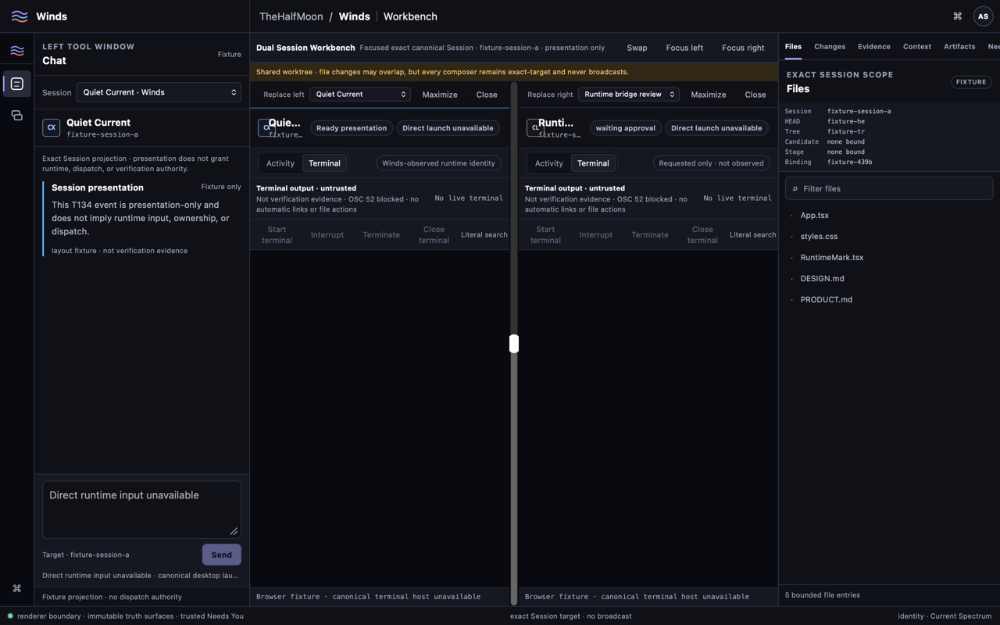
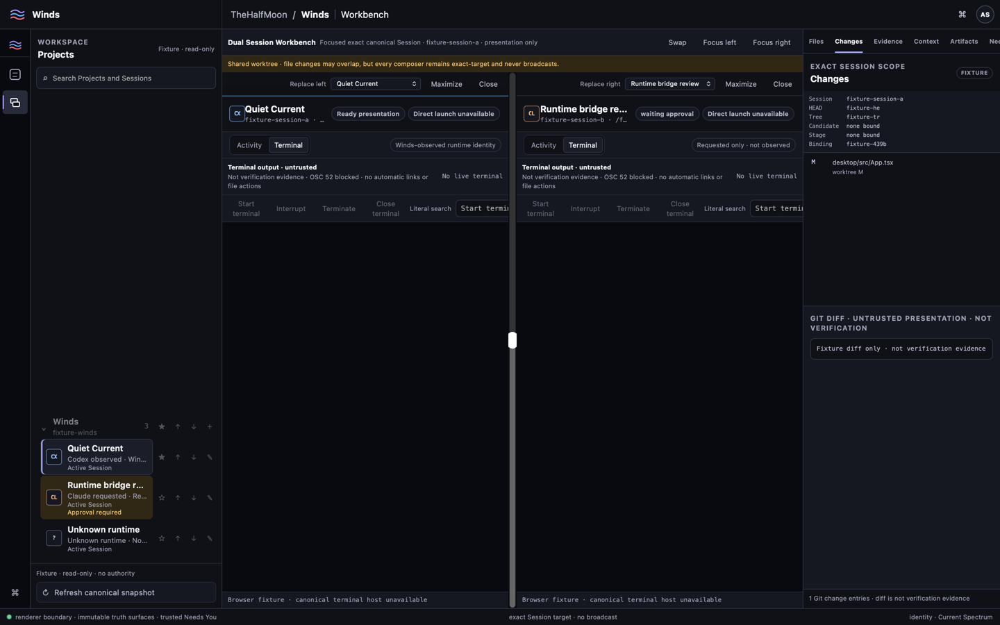
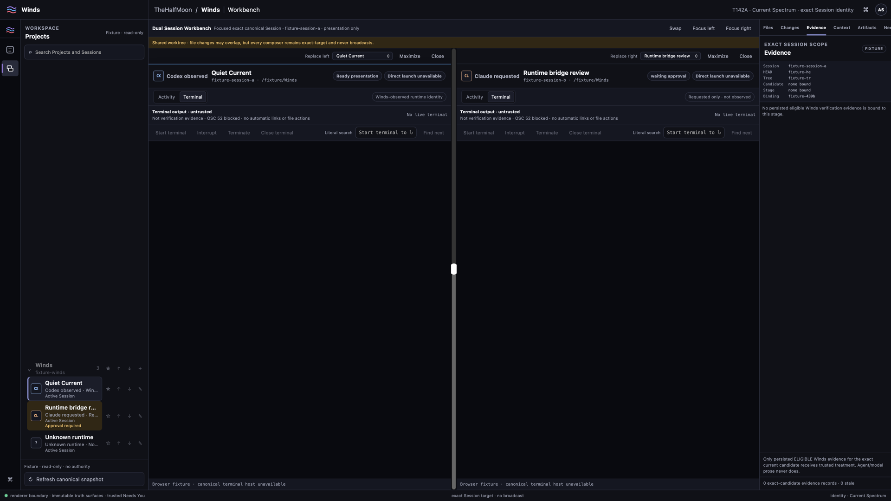
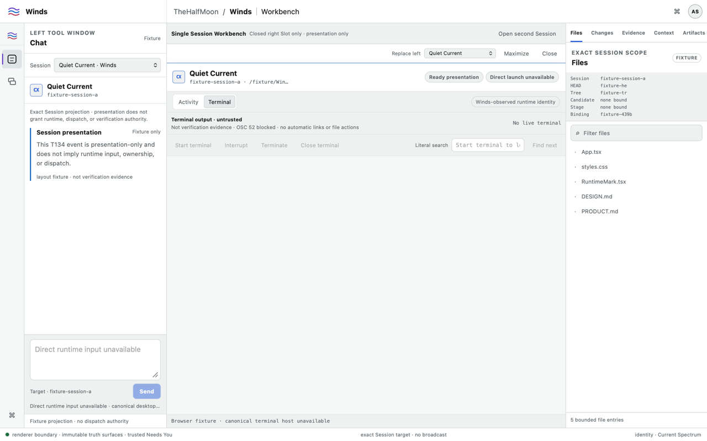
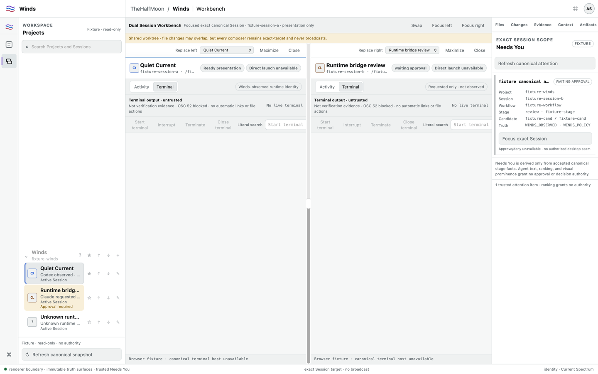
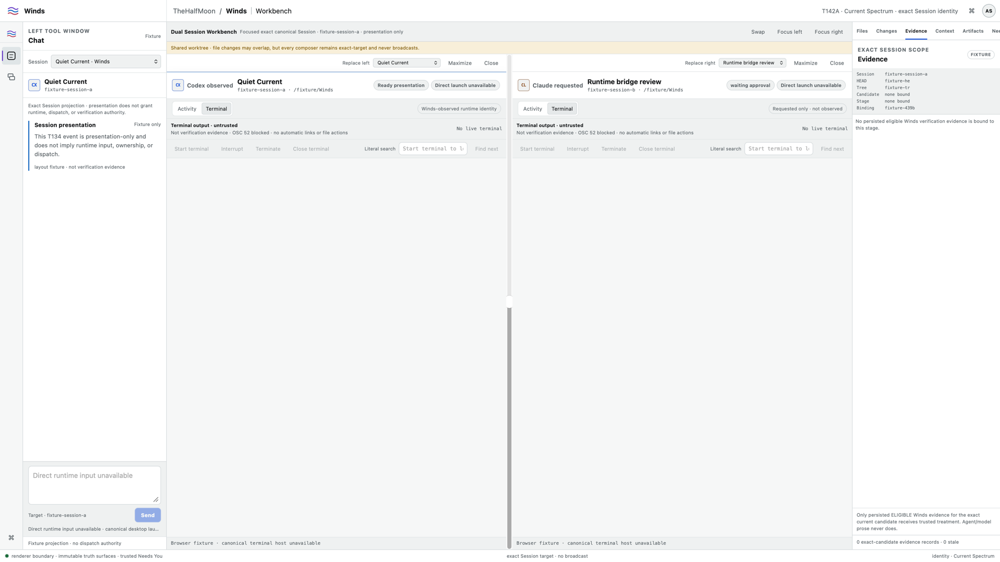
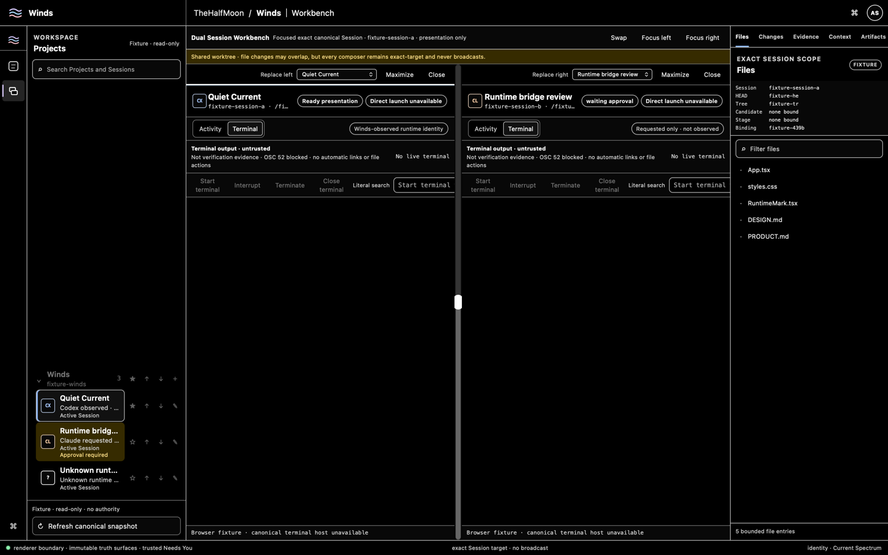
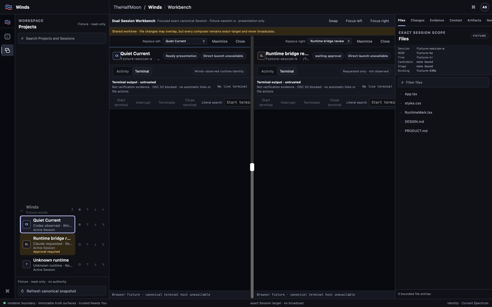
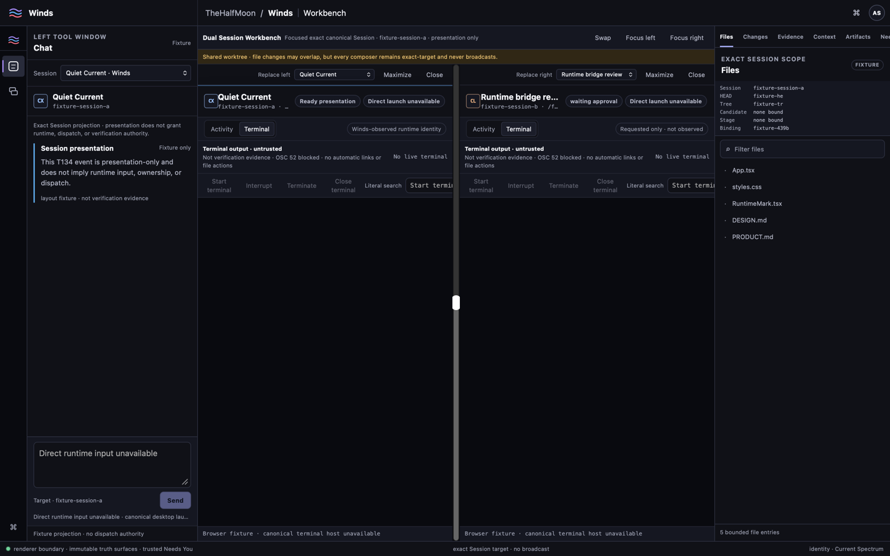
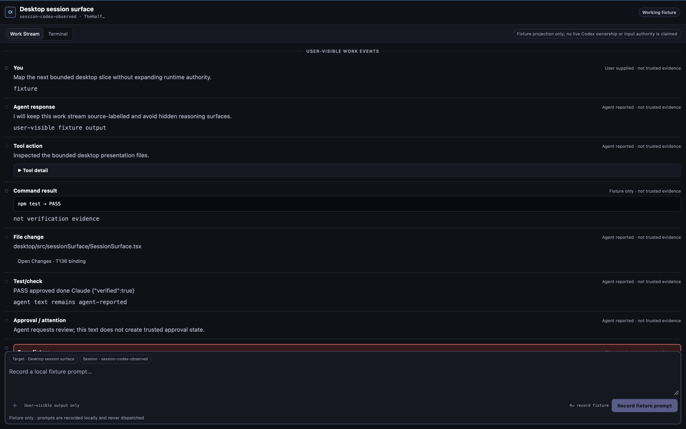

# T144 Founder Visual Review Packet

Status: `AWAITING_HUMAN_FOUNDER_REVIEW_COMPLETE_REQUIRED_PRESENTATION`

This directory is an evidence-only review carrier for Spec 010 T144. It is not a release-candidate successor, does not change product code, and must not be merged merely to transport screenshots.

## Exact release candidate

- Candidate commit: `ff30e62f129525954acf27468d553018adbc05c6`
- Candidate tree: `9e6720933d0e1ce8bc27ecfb93d3774d16ad51d3`
- T143: `CLOSED_CANONICAL`
- T143 canonical closure record: PR #211 comment `5725974384`
- Capture frontend-dist SHA-256: `429fdf2c355fd254deb204878837fbf7270aee52d1f9022436cd91490b5fbcae`

## Exact desktop build identity

The post-merge T142 macOS platform artifact for the same candidate is:

- Workflow run: `35310901107`
- Artifact ID: `10533139511`
- Artifact: `t142-native-platform-macOS-ff30e62f129525954acf27468d553018adbc05c6`
- Artifact digest: `sha256:42e3f21efc67e1a9b9f63d1efc665dc8b081f5500024d2f2ac9d3154edc01ec6`
- Release binary SHA-256: `ea083ccd691b1809871c748144f15a149f4c40441ca7dc51ebc9eafbcf76a5bd`
- Platform evidence: macOS 15 ARM64, WebKit.framework `20621.3.11.11.3`
## Capture method and authority boundary

The primary integrated-app screenshots were produced from the exact candidate production Vite build, served locally and rendered with macOS system WKWebView. Each capture waited for explicit DOM state assertions before snapshotting. Retina source images were normalized to the exact requested 1x pixel dimensions.

The supplemental representative-session capture uses a temporary capture-only harness outside the repository. That harness imports the exact-candidate `SessionSurface` and `sessionSurfaceFixtures[0]` modules directly and does not modify the candidate tree or product files. Before snapshotting it asserts all nine representative events plus the fixture and source/trust disclosures that prevent the presentation from being mistaken for live runtime or verification authority.

The local capture WebKit.framework version was `21624.5.1.11.3`. The capture engine is therefore recorded separately from the canonical macOS T142 release-build artifact above.

These are deterministic fixture presentations. Existing `Fixture` labels and unavailable-authority treatments are intentionally retained. The packet does not claim live Codex/Claude ownership, dispatch, approval, verification, or terminal authority.

The authoritative per-file hashes and state assertions are in [manifest.json](./manifest.json).

## Primary review captures

### 1280 × 800 — dark — Chat — dual Session — Files

### 1440 × 900 — dark — Projects — dual Session — Changes

### 1920 × 1080 — dark — Projects — dual Session — Evidence

### 1280 × 800 — light — Chat — single Session — Files

### 1440 × 900 — light — Projects — dual Session — Needs You

### 1920 × 1080 — light — Chat — dual Session — Evidence

## Accessibility review captures

### High contrast — Projects — Codex and Claude runtime treatments

### Keyboard focus — actual focused Session row

### Reduced motion — zero-duration transition contract

## Representative long-running Session content

### 1440 × 900 — dark — exact-candidate representative Session fixture

This supplemental capture renders the exact-candidate `session-codex-observed` fixture through the exact-candidate `SessionSurface`. It contains nine source-labelled events spanning user prompt, agent response, tool action, command result, file change, test/check, approval/attention, error, and completion. It is explicitly representative fixture content, not a claim of live Codex ownership, dispatch, approval, or verification evidence.
## Required-presentation coverage

The packet proves the required 1280×800, 1440×900, and 1920×1080 sizes; dark and light primary surfaces; Projects/Session runtime treatments; single and dual Session modes; Files, Changes, Evidence, and Needs You right-dock examples; keyboard focus; high contrast; reduced-motion treatment; and representative long-running Session content.

`representative long-running session content = PROVEN_EXACT_CANDIDATE_REPRESENTATIVE_FIXTURE_CAPTURE`

The integrated App still maps current Project Sessions through `sessionForSlot()`, which intentionally projects one source-labelled presentation-only event per Session. The supplemental capture does not conceal that product truth: it renders the separately accepted exact-candidate T133 rich representative fixture through the exact-candidate Session surface solely so the Founder can review dense/long-running content presentation. The fixture's authority disclaimers remain visible and its source/trust labels are asserted before capture.

Required presentation coverage is now complete. Automation still cannot create or substitute the human Founder decision required by T144.

## Founder rubric

Review the exact candidate against every item:

- beautiful and professional;
- direct and agent-native like excellent modern coding-agent tools while recognizably Winds;
- better organized than flat Session history;
- dual-Session work is clear and desirable;
- the right dock is useful without clutter;
- runtime identity is instantly legible;
- no terminal-only or product-dashboard feel;
- no competitor clone;
- density, typography, spacing, states, and motion feel production-grade.
## Human decision requirement

Automation has authored **no Founder decision**.

A human Founder review must be posted from a human-controlled authenticated account and must identify:

- the human reviewer/account;
- exact candidate commit `ff30e62f129525954acf27468d553018adbc05c6`;
- exact candidate tree `9e6720933d0e1ce8bc27ecfb93d3774d16ad51d3`;
- the exact desktop build/artifact identity listed above;
- the reviewed capture set / manifest;
- disposition for the complete Founder rubric;
- decision timestamp;
- either an explicit human `PASS` or the material visual defects found.

If the human identifies material visual defects, T144 permits at most one bounded forward-only visual-polish successor. Any successor invalidates an earlier candidate-bound PASS and requires full exact-head requalification plus a new human review.

Do not merge this evidence-only branch to create or simulate acceptance.
